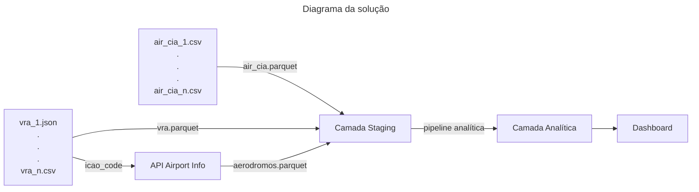

# Página Inicial - BigDataAirlines

O intuito desse repositório é um pequeno estudo de caso utilizando dados de aviação, disponibilizados em diferentes formatos de arquivo, nominalmente json e csv. Além do consumo de uma [API](https://rapidapi.com/Active-api/api/airport-info) a partir dos dados presentes nesses arquivos.

Na sequência, os dados passam por uma pipeline analítica com os resultados sendo apresentados em um Dashboard via streamlit

